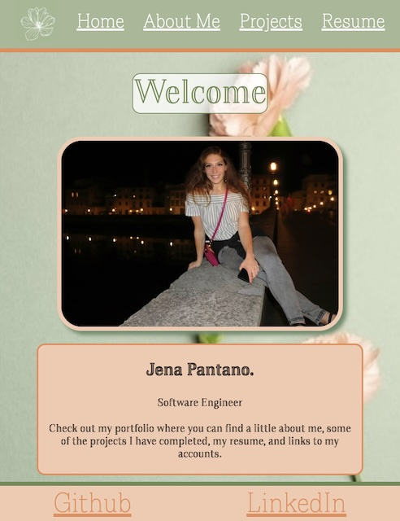

# Jena Pantano's Portfolio

Click the image above to be directed to the home page. :point_up_2:

#

# Description: 
Above you can find a link to my porfolio page where you can view information about me, my resume, projects I've completed, and links to my other accounts. 

#

 

Instructions:

▶️ In order to navigate to my portfolio page, click on the Welcome page image above. 
  
▶️ To play Tic-Tac-Toe, navigate to the projects section in the navigation bar and click on the image in the center of the page. 
  
▶️ To download my resume, navigate to resume page and click the download button. 

 

 User Stories:

 <ul> 
  <li> As a friend of Jena Pantano, I want to view her portfolio so that I can see the work she has done during her time at general assembly.</li>
  <li> As a potential employer, I want to view Jena's projects, her resume, and look at how her portfolio was designed, so that I can assess whether she is a good fit for the company.</li>
 </ul>

 
 :art: Wire Frame 

   
 
    
 ✏️ Rough Sketch 

     
   

 
 
 🎮 Game 

 

 
 

  
 

 
 

 
 💻 Portfolio 

 <h3 align="center"> Home Page </h3>

<h3 align="center"> About Me </h3>

 

<h3 align="center"> Resume </h3>

<h3 align="center"> Projects </h3>

 
 
 Challenges 

 Descriptions of any unsolved problems or major hurdles that were overcome. 
 <ul>
  <li> The images in the carousel are different sizes and I would like to have them all be the same size without having the image being changed.</li>
  <li> One challenge I overcame was formatting the whole website to be responsive especially, the Tic-Tac-Toe game. I changed the pages to use CSS grid and some flexbox. </li>
  <li> The formatting of the carousel was a challenge for me. I had trouble with the placement of the previous and next buttons. </li>
  <li> Challenges with formatting the scoreboard in Tic-Tac-Toe. </li>
 </ul>

 
 
 ❓ Future Features 

  Next steps planned: 
 <ul>
  <li> Fixes to above unsolved problems. </li>
  <li> Add a flip feature to the resume boxes. </li>
  <li> Add captions on hover to the carousel on the about me page. </li>
  <li> Add play against the computer feature in Tic-Tac-Toe. </li>
  <li> Add CSS transitions and animations. </li>
  <li> Create a cake decorating game. </li>
 </ul>

#

### Deployed Link 🔗
<a href="https://jpantano30.github.io/Jena-Pantano-Portfolio/"> Jena Pantano's Portfolio </a> 

#

## Technologies used: 👩‍💻

